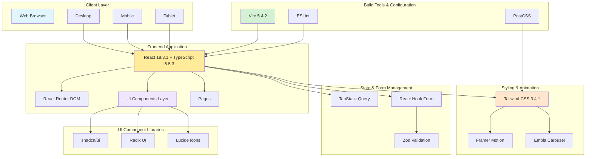

# Journée Internationale de l'Homme - 19 Novembre

Site web dédié à la célébration de la Journée Internationale de l'Homme, promouvant le bien-être, la santé mentale et les contributions positives des hommes dans la société.

## Description

Ce projet est une application web moderne créée pour sensibiliser et célébrer la Journée Internationale de l'Homme célébrée chaque année le 19 novembre. L'objectif est de promouvoir l'égalité des genres, mettre en avant les modèles masculins positifs, et encourager le dialogue sur les problématiques masculines.

## Architecture du Projet



## Technologies Utilisées

### Frontend
- **React** (^18.3.1) - Bibliothèque JavaScript pour créer l'interface utilisateur
- **TypeScript** (^5.5.3) - Superset de JavaScript avec typage statique
- **Vite** (^5.4.2) - Outil de build ultra-rapide pour le développement

### Styling & UI
- **Tailwind CSS** (^3.4.1) - Framework CSS utility-first
- **shadcn/ui** - Collection de composants réutilisables construits avec Radix UI
- **Radix UI** - Composants UI accessibles et non stylés
- **Lucide React** (^0.446.0) - Bibliothèque d'icônes

### Routing & Forms
- **React Router DOM** (^6.26.2) - Gestion de la navigation
- **React Hook Form** (^7.53.0) - Gestion des formulaires
- **Zod** - Validation de schémas TypeScript-first

### Animations & Interactions
- **Framer Motion** - Bibliothèque d'animations pour React
- **Embla Carousel React** (^8.3.0) - Carrousel tactile

### State Management
- **TanStack Query** (^5.56.2) - Gestion de l'état serveur et cache

### Utilitaires
- **date-fns** (^4.1.0) - Manipulation de dates
- **Sonner** (^1.5.0) - Notifications toast
- **clsx** & **class-variance-authority** - Gestion des classes CSS

## Installation

### Prérequis
- Node.js (version 18 ou supérieure)
- npm ou yarn

### Étapes d'installation

1. Cloner le repository
```bash
git clone https://github.com/TaniaW777/international-mens-day.git
cd international-mens-day
```

2. Installer les dépendances
```bash
npm install
```

3. Lancer le serveur de développement
```bash
npm run dev
```

L'application sera accessible sur `http://localhost:8080`

## Scripts Disponibles

```bash
npm run dev          # Démarre le serveur de développement
npm run build        # Compile le projet pour la production
npm run preview      # Prévisualise la version de production
npm run lint         # Vérifie le code avec ESLint
```

## Structure du Projet

```
MEN_DAY/
├── node_modules/           # Dépendances installées
├── public/                 # Fichiers statiques
├── src/                    # Code source de l'application
│   ├── assets/             # Ressources (images, fonts, etc.)
│   ├── components/         # Composants React réutilisables
│   ├── hooks/              # Hooks React personnalisés
│   ├── lib/                # Utilitaires et configurations
│   ├── pages/              # Pages de l'application
│   ├── App.css             # Styles du composant App
│   ├── App.tsx             # Composant principal
│   ├── index.css           # Styles globaux
│   ├── main.tsx            # Point d'entrée de l'application
│   └── vite-env.d.ts       # Types pour Vite
├── .gitignore              # Fichiers à ignorer par Git
├── components.json         # Configuration shadcn/ui
├── eslint.config.js        # Configuration ESLint
├── index.html              # Template HTML principal
├── package-lock.json       # Verrouillage des versions de dépendances
├── package.json            # Dépendances et scripts du projet
├── postcss.config.js       # Configuration PostCSS
├── README.md               # Documentation du projet
├── tailwind.config.ts      # Configuration Tailwind CSS
├── tsconfig.app.json       # Configuration TypeScript pour l'app
├── tsconfig.json           # Configuration TypeScript principale
├── tsconfig.node.json      # Configuration TypeScript pour Node
└── vite.config.ts          # Configuration Vite
```

## Fonctionnalités

- Interface moderne et responsive
- Navigation fluide entre les pages
- Compatible mobile, tablette et desktop
- Accessible (normes WCAG)
- Animations et transitions élégantes
- Gestion de contenu dynamique

## Déploiement

Le projet peut être déployé sur plusieurs plateformes :

- Vercel (recommandé)
- Netlify
- GitHub Pages
- Cloudflare Pages

### Build pour la production
```bash
npm run build
```

Les fichiers optimisés seront dans le dossier `dist/`.

## Contribution

Les contributions sont les bienvenues. Pour contribuer :

1. Fork le projet
2. Créer une branche (`git checkout -b feature/amelioration`)
3. Commit vos changements (`git commit -m 'Ajout d'une fonctionnalité'`)
4. Push vers la branche (`git push origin feature/amelioration`)
5. Ouvrir une Pull Request

## Licence

Ce projet est sous licence MIT. Voir le fichier `LICENSE` pour plus de détails.

## Auteur

**Tania** - Développeuse principale

## Contact

Pour toute question ou suggestion, n'hésitez pas à ouvrir une issue sur GitHub.

---

Célébrons ensemble la Journée Internationale de l'Homme.